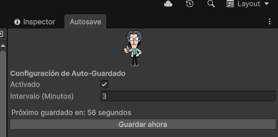

<h1 align="center"> Otacon Autosave Tool for Unity</h1>

  

A lightweight, customizable editor tool to prevent progress loss. It automatically saves your scenes and assets at your preferred intervals, with visual feedback directly in the Editor.

---

## Features

* **Automatic Saving:** Saves both your open scenes and project assets simultaneously.
* **Custom Intervals:** Flexible timer (in minutes) to fit your specific workflow.
* **Visual Feedback:** Displays a native notification with a custom icon in the **Scene View** whenever a save occurs.
* **Global Integration:** Runs entirely in the background. No need to attach scripts to GameObjects or modify your scenes.

---

##  Installation

1.  **Download the Package:** Go to the [Releases](https://github.com/tu-usuario/tu-repo/releases) page and download `OtaconAutosave.unitypackage`.
2.  **Import to Unity:** * Go to `Assets` > `Import Package` > `Custom Package...`
    * Select the downloaded file and click **Import**.
3.  **Manual Setup:** Alternatively, copy the `OtaconAutoSaveTool` folder into your project's `Assets/Tools` directory.

---

##  How to Use

1.  **Open Config:** Navigate to the top menu: **Tools > Autosave Config**.
2.  **Toggle Status:** Use the checkbox to enable or disable the autosave functionality.
3.  **Set Timer:** Enter the desired minutes between saves (e.g., `5` or `10`).
4.  **Workflow:** You can dock the window or close it; the tool uses `[InitializeOnLoad]` to keep running as long as the project is open.

---

## ? Important Notes

* **Play Mode:** To avoid data corruption or lag spikes, the tool **will not save** while Unity is in Play Mode.
